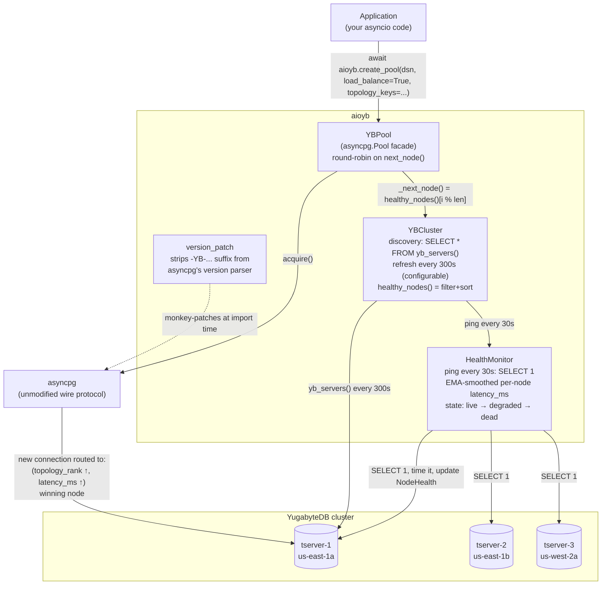
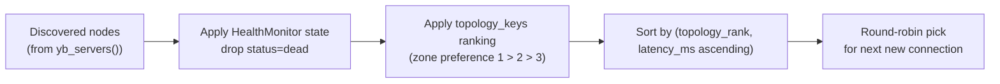

# aioyb — YugabyteDB smart-driver features for asyncpg

YugabyteDB ships an official Python smart driver for **psycopg2 only**
(`psycopg2-yugabytedb`) and recommends `aiopg` for asyncio (which still
uses psycopg2's blocking core under the hood). There is **no native async
smart driver** — `asyncpg` works against YB in most cases but lacks the
smart-driver features (cluster-aware connection distribution, topology-
aware load balancing, automatic node discovery, refresh interval) and
has a known compatibility bug parsing YB's server version string.

`aioyb` is a thin wrapper around `asyncpg` that closes that gap:

- **Topology discovery** — periodic `SELECT * FROM yb_servers()` to learn
  the live tablet-server list, refresh interval configurable (default
  300 s, matching the official sync driver default).
- **Active health monitoring** — independent ping loop (default every
  30 s) hits every known node with `SELECT 1`, tracks EMA-smoothed
  latency, and demotes nodes through `live → degraded → dead` so
  unreachable or slow nodes are excluded from connection selection.
- **Connection load balancing** — round-robin across the **healthy** node
  list; a 100-conn app against a 10-node cluster spreads ~10 connections
  per node, but a dead node gets 0 instead of breaking 10 % of attempts.
- **Latency-aware ordering** — within a topology-preference tier, faster
  nodes are tried before slower ones, so a brief AZ slowdown bleeds off
  load to nearby AZs without falling over the whole pool.
- **Topology-aware routing** — `topology_keys="cloud1.region1.zone1:1,cloud2.region2.zone2:2"`
  prefers placement zones by preference (`:1` primary, `:2` first
  fallback, etc.) per the same syntax as the official YB driver.
- **Version-string fix** — patches asyncpg's `_parse_server_version`
  to accept YB's mixed string format (asyncpg's strict integer parser
  rejects `"11.2-YB-2.20.0.0-b0"`).
- **Pool API mirrors `asyncpg.create_pool`** so existing code drops in:
  `pool = await aioyb.create_pool(dsn, load_balance=True, topology_keys=...)`.

## Status

**Pre-alpha.** Skeleton only — see `docs/STATUS.md` for the implementation
roadmap.

## Architecture



Connection-routing decision:



## Install (when published)

    pip install aioyb

For now, install editable from this repo:

    pip install -e .

## Example

```python
import asyncio
import aioyb

async def main():
    pool = await aioyb.create_pool(
        dsn="postgresql://yugabyte@yb-0.example.com:5433/mydb",
        load_balance=True,
        topology_keys="aws.us-east-1.us-east-1a:1,aws.us-west-2.us-west-2a:2",
        yb_servers_refresh_interval=300,
        min_size=2,
        max_size=20,
    )
    async with pool.acquire() as conn:
        rows = await conn.fetch("SELECT 1")
        print(rows)
    await pool.close()

asyncio.run(main())
```

## License

Apache-2.0 — see [`LICENSE`](LICENSE).
